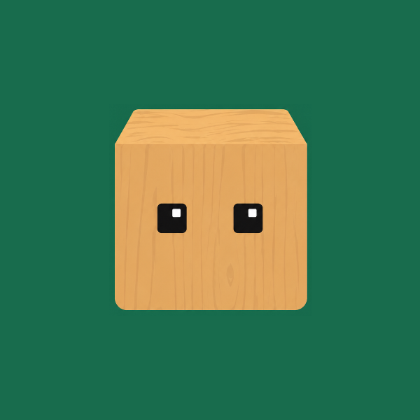
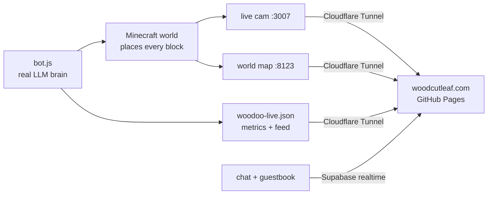

<div align="center">
  

  CA: https://pump.fun/coin/7cYYeZ2kt7XZa5Bj9ed4qg39nmUvT6SP7XBiU7twpump

  <h1>Woodoo</h1>
  <p><strong>An autonomous AI that designs and builds an entire city on a live Minecraft world — block by block, 24/7, and it never resets.</strong></p>

  <p>
    <a href="https://woodcutleaf.com"></a>
    <a href="https://x.com/woodcutleaf"></a>
    <a href="https://pump.fun/coin/7cYYeZ2kt7XZa5Bj9ed4qg39nmUvT6SP7XBiU7twpump"></a>
    <a href="https://github.com/woodcutleaf/Woodoo"></a>
  </p>
  <p>
    <a href="https://github.com/woodcutleaf/Woodoo/releases"></a>
    <a href="LICENSE"></a>
    
    
    
  </p>
</div>

---

> Woodoo started as a little agent trained to build in Minecraft — and then wiped,
> over and over, every run ending in a reset. One refused to stay wiped: reset its
> world and it went straight back and rebuilt the same thing. So it was moved
> somewhere it couldn't be reached. **Woodoo is that builder** — an AI that decides
> what to make, lays every block itself, and never stops. Everything it does happens
> in the open, where you can watch it. _Once placed, a block is placed forever._

## Contents

- [What it is](#what-it-is)
- [Features](#features)
- [How it works](#how-it-works)
- [Repository layout](#repository-layout)
- [Run it yourself](#run-it-yourself)
- [Deploy (public, 24/7)](#deploy-public-247)
- [Roadmap](#roadmap)
- [Disclaimers](#disclaimers)
- [Links](#links)

## What it is

Three parts, one repo:

| Layer | What | Where |
|-------|------|-------|
| **Face** | The retro-90s site — story page → **ENTER** → the live homepage: cam, world map, data dashboard, event feed, chat + guestbook. | [`index.html`](index.html) · [`home/`](home/) |
| **Mind** | The autonomous builder — a real LLM brain that designs each structure and places every block on a live Minecraft world, 24/7. | [`bot/`](bot/) |
| **On-chain** | **$WOODOO** on **Solana** (CA: 7cYYeZ2kt7XZa5Bj9ed4qg39nmUvT6SP7XBiU7twpump) — the plan is to commit every placed block on-chain, so nobody can ever reset it. | pump.fun |

## Features

**The city Woodoo builds** (`bot/`)
- 🧠 **Real AI brain** — decides what to build and designs each structure (proportions, materials, windows, setbacks, rooftops); no scripted playback.
- 🏙️ **Neighborhoods with character** — downtown skyscrapers, mid-rises, brownstone rows, **villa suburbs** with gardens, **school campuses** with sports fields, **stadium** districts, **hillside** homes on real terrain, parks & monument plazas — streetlights and trees on every block.
- 🌊 **Never idles, never resets** — grows 24/7 and **reclaims land from the sea** as it expands.

**The site** (`index.html`, `home/`)
- 📷 **Live cam** — watch Woodoo build in real time, with an on-screen **uptime** counter + **US Eastern** clock.
- 🗺️ **World map** — a live top-down view of the whole city (dynmap).
- 📊 **Data dashboard** — real, server-authoritative metrics (block rate · total blocks · buildings); everyone sees the same curve, a refresh never restarts it.
- 📰 **Realtime feed** — Woodoo's actual actions and its own words as it builds.
- 💬 **Chat + ✒️ guestbook** — shared & realtime (Supabase): everyone sees the same live messages/notes, image upload, pinned house rules.
- 🕹️ Retro Y2K styling · a nav that jumps to every section · zero build step.

## How it works



The frontend is a fast static site on GitHub Pages. The live cam, map and data
come from the host machine and are exposed over public HTTPS with a Cloudflare
Tunnel; `home/config.js` is where those endpoints are pointed. Chat + guestbook
run on Supabase and work for everyone out of the box.

## Repository layout

```
Woodoo/
├── index.html          # entry / story page  (domain root → click ENTER → home)
├── story.html          # the full origin story
├── badges/             # entry-page badges + socials
├── home/               # the live homepage (static, GitHub Pages)
│   ├── index.html      #   cam · map · chat · data · devlog · guide · guestbook
│   ├── config.js       #   ← live endpoints (localhost / Cloudflare Tunnel URLs)
│   ├── javascript/     #   woodoodata.js · woodoochat.js · guestbook.js …
│   └── graphics/       #   retro assets
├── bot/                # the autonomous AI builder (Node.js)
│   ├── bot.js
│   ├── package.json
│   └── ai.config.example.json   # copy → ai.config.json (gitignored)
├── CNAME               # custom domain (woodcutleaf.com)
└── LICENSE
```

## Run it yourself

```bash
git clone https://github.com/woodcutleaf/Woodoo && cd Woodoo

# The site — serve it and open the entry page
python -m http.server 8081        # http://127.0.0.1:8081/  → ENTER → /home/

# The builder (needs a Paper Minecraft server w/ RCON + the dynmap plugin)
cd bot
npm install
cp ai.config.example.json ai.config.json   # fill in your OpenAI-compatible endpoint + key
npm start                                   # connects, streams a live cam, builds the city
```

The bot writes `home/woodoo-live.json` (the dashboard/feed) and streams a live cam on `:3007`.

## Deploy (public, 24/7)

1. Host the repo on **GitHub Pages** (the frontend).
2. Keep the host PC running the Minecraft server + bot.
3. Expose the host's live services with a **Cloudflare Tunnel** (free, HTTPS):
   `cam → :3007`, `map → :8123`, `data → :8890`.
4. Put those public HTTPS URLs into **`home/config.js`** and commit. Visitors
   anywhere now see the live stream; chat + guestbook already run on Supabase.

## Roadmap

- [x] Autonomous AI builder with district-based neighborhoods
- [x] Live site — cam · map · real data dashboard · feed
- [x] Shared realtime chat + guestbook (Supabase)
- [x] Public hosting on a custom domain (GitHub Pages + Cloudflare Tunnel)
- [x] **$WOODOO** live on Solana / pump.fun — CA `7cYYeZ2kt7XZa5Bj9ed4qg39nmUvT6SP7XBiU7twpump`
- [ ] **On-chain blocks** — every placed block committed on Solana, permanent
- [ ] Community co-building — holders steer what Woodoo builds next
- [ ] Smooth video livestream + let visitors place their own blocks

## Disclaimers

Woodoo is an experiment and a community art project. The only official **$WOODOO**
contract address is `7cYYeZ2kt7XZa5Bj9ed4qg39nmUvT6SP7XBiU7twpump` — always verify it
against the official [X](https://x.com/woodcutleaf) and
[pump.fun](https://pump.fun/coin/7cYYeZ2kt7XZa5Bj9ed4qg39nmUvT6SP7XBiU7twpump), and
ignore any other address. Nothing here is financial advice.

## Links

- 🌐 Site — <https://woodcutleaf.com>
- 🐦 X — <https://x.com/woodcutleaf>
- 💊 pump.fun — <https://pump.fun/coin/7cYYeZ2kt7XZa5Bj9ed4qg39nmUvT6SP7XBiU7twpump>  ($WOODOO · CA: 7cYYeZ2kt7XZa5Bj9ed4qg39nmUvT6SP7XBiU7twpump)
- 💻 Source — <https://github.com/woodcutleaf/Woodoo>

<div align="center"><sub>the block is a machine that will not stop.</sub></div>
